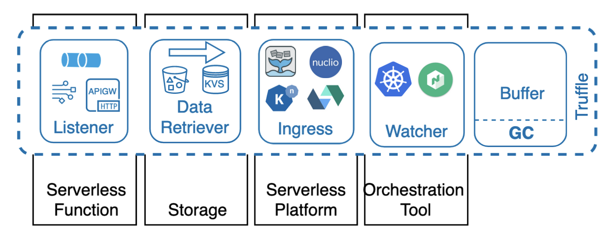

# Truffle: Efficient Data Passing for Serverless Functions 

  

Truffle has a modular architecture that enables Serverless functions to efficiently pass and fetch data by leveraging functions cold starts.  